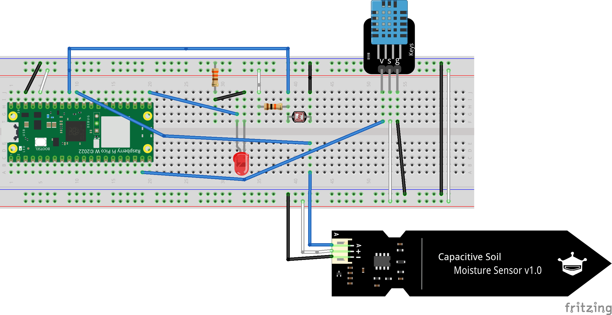

# Plant Monitor with Raspberry Pi as a controller

## Index

- [Introduction](#introduction)
- [Objective](#objective)
- [Material](#material)
- [Computer Setup](#computer-setup)
- [Putting everything together](#putting-everything-together)
- [Platform](#platform)
- [The code](#the-code)
- [Transmitting the data / connectivity](#transmitting-the-data--connectivity)
- [Presenting the data](#presenting-the-data)
- [Finalizing the Design](#finalizing-the-design)

## Introduction

This tutorial will guide you through the process of creating a plant monitor using a Raspberry Pi as a controller. The project may take approximately 4-7 hours to complete provided you have all the hardware available.

The project creates a notification system that will alert you over Discord when your plant needs watering (or is drowning). The project will use a Raspberry Pi as a controller and as a local server to monitor the soil moisture of the plant and send a message to Discord when the soil moisture is too low or too high.

*Author: ```Pontus Grandin```*

*ID: ```pg222pb```*

## Objective

I often forget to water my plants. A device that would alert me when my plants need attention would therefore be useful. The project reads and stores the soil moisture of the plant as well as the humidity and temperature of the room. Although the moisture levels is what will trigger the alert.

The moisture, humidity and temperature is displayed in a web interface that is accessible on the local network for the user to monitor and interpret.

## Material

| Item | Purpose | Price | Link |
|----------|----------|----------|----------|
| Raspberry Pi 4 Model B (4GB) | Host our IoT Stack and MQTT Broker | 810 SEK | [Amazon.se](https://www.amazon.se/-/en/dp/B09TTNF8BT?ref=ppx_yo2ov_dt_b_product_details&th=1) |
| Geekworm Raspberry Pi 4 Case | Act as cover to protect the Raspberry Pi **(Not necessary to complete the tutorial)** | 166 SEK | [Amazon.se](https://www.amazon.se/-/en/dp/B07ZVJDRF3?ref=ppx_yo2ov_dt_b_product_details&th=1) |
| Raspberry Pi Pico WH| Acts as the microcontroller which reads and sends data | 109 SEK | [Electrokit](https://www.electrokit.com/en/raspberry-pi-pico-wh) |
| SanDisk MobileMate UHS-I microSD Reader | Used for loading the Raspberry Pi OS onto the MicroSD card | 93 SEK | [Amazon.se](https://www.amazon.se/-/en/dp/B07G5JV2B5?ref=ppx_yo2ov_dt_b_product_details&th=1) |
| Sonero Micro HDMI to HDMI Cable | To graphically interact with the Raspberry Pi Desktop | 76 SEK | [Amazon.se](https://www.amazon.se/-/en/dp/B0BWNQ2L3K?ref=ppx_yo2ov_dt_b_product_details&th=1) |
| AZDelivery Ground Moisture Sensor Hygrometer Module V1.2 Capacitive | Reads the moisture in the soil | 69 SEK | [Amazon.se](https://www.amazon.se/-/en/dp/B07HJ6N1S4?ref=ppx_yo2ov_dt_b_product_details&th=1) |
| Solderless Breadboard 840 tie-points | Used for connecting the sensors and LED to the Pico WH | 69 SEK | [Electrokit](https://www.electrokit.com/en/kopplingsdack-840-anslutningar) |
| KIOXIA 32GB EXCERIA microSD | Holds the Raspberry Pi OS, influxDB data and acts as the main memory storage for the Raspberry Pi | 55 SEK | [Amazon.se](https://www.amazon.se/-/en/dp/B088RQCCDJ?psc=1&ref=ppx_yo2ov_dt_b_product_details) |
| Jumper Wires Male/Male | Run electrical currents for giving power/sensor readings | 49 SEK | [Electrokit](https://www.electrokit.com/en/labbsladd-40-pin-30cm-hane/hane) |
| Digital temperature and humidity sensor DHT11 | Reading the temperature and humidity of the air | 49 SEK | [Electrokit](https://www.electrokit.com/en/digital-temperatur-och-fuktsensor-dht11) |
| 2x USB-Cable A-Male to Micro B-Male *Adapter not included* | Powers the Pico and the Raspberry Pi | 28 SEK | [Electrokit](https://www.electrokit.com/en/usb-kabel-a-hane-micro-b-hane-60cm) |
| Photo resistor CdS 4-7 kohm  | Reads the light that the plants receive | 8 SEK | [Electrokit](https://www.electrokit.com/en/fotomotstand-cds-4-7-kohm) |
| LED 5mm Red Diffuse | Lights up when the plant needs attention | 5 SEK | [Electrokit](https://www.electrokit.com/en/led-5mm-rod-diffus-1500mcd) |
| Resistor 0.25W 330R | Limits the current running to the LED | 1 SEK | [Electrokit](https://www.electrokit.com/en/motstand-kolfilm-0.25w-330ohm-330r) |
| Resistor  0.25W 10kohm (10k) | Acts as a voltage divider for the photoresistor | 1 SEK | [Electrokit](https://www.electrokit.com/motstand-kolfilm-0.25w-10kohm-10k) |

The table lists the electrokit items as individual pieces, they were however bought in these two following kits:

- [LNU Start kit](https://www.electrokit.com/lnu-starter)
- [Sensor Kit - 25 Modules](https://www.electrokit.com/sensor-kit-25-moduler)

*Note: The MicroHDMI to HDMI cable is not strictly necessary as you can grab the Raspberry Pi's IP address without graphically interfacing with it. However these steps are not included in this tutorial.*

## Computer Setup

The project was developed on a PC running Windows 10.

### IDE and plugins

The IDE of choice is [Vistual Studio Code](https://code.visualstudio.com/), other options are Tommy and Atom. Visual Studio Code was chosen due to the author already being familiar with the IDE.
The following two extensions were installed in VSC for Python language support, as the Raspberry Pi Pico runs on Micropython in this project, and transferrence of code to the Pico WH. [Python](https://marketplace.visualstudio.com/items?itemName=ms-python.python), for its language support, and [Pymakr](https://marketplace.visualstudio.com/items?itemName=pycom.Pymakr), for its ability to transfer code to the Pico WH.

### Raspberry Pi Pico WH Firmware

Grab the latest firmware from [Micropython's website](https://micropython.org/download/RPI_PICO_W/). The firmware is flashed onto the Pico WH by connecting the Pico WH to your computer using the Micro USB cable and holding down the white BOOTSEL button. A new drive will appear on your computer, drag and drop the firmware onto the drive. The Pico WH will restart and the firmware is now flashed.

### Raspberry Pi OS Installation

To install the Raspberry Pi Operating Systemn we use the MicroSD card and card reader and the official [Raspberry Pi Imager software](https://www.raspberrypi.com/software/). Using the software allows us to easily install the Raspberry Pi OS onto the MicroSD card and preconfigure Wifi and SSH settings, so we can access the Raspberry Pi remotely. The username and password for the Raspberry Pi OS is used when connecting to the Raspberry Pi through SSH if you select the **Use password authentication** option. The author used the Public-key option and could simply SSH into the Raspberry Pi with the following command:

```bash
ssh <username>@<raspberry-ip-address>
```

This requires us to know the IP address of the Raspberry Pi, which can be found by connecting the Raspberry Pi to a monitor and hovering over the Wifi icon in the top right corner of the screen. There are other options of finding the IP address remotely which do not require plugging the Raspberry Pi into a monitor, but they are not covered in this tutorial.

### Installing Mosquitto, Node-Red, InfluxDB and Grafana

IoT-stack was used to quickly setup the visualisation/mqtt stack. The IoT stack program was pulled onto the raspberry pi using the following terminal command:

```cmd
curl -fsSL https://raw.githubusercontent.com/SensorsIot/IOTstack/master/install.sh | bash
```

This downloads the IoT stack program onto the raspberry pi and installs it.

IoT-stack builds a docker-compose file which allows us to quickly launch all of these applications with a single command and not have to worry too much about configuration.

Following this we then enter the menu of the program by opening the menu.sh file located in the IOTstack folder.

```cmd
cd IOTstack/menu.sh
```

We now select the programs we wish to install. This project runs the stack grafana, influxdb, mosquitto as a broker and Node-Red. We select these programs by navigating the menu and selecting them. The program will then build the docker-compose file and launch the applications once the ```Start Stack``` option is selected.

Following this we set up the influxdb database by actually creating the database to which we will write. We will name it "sensor data". To do this we access the command line of the influxdb application by using this command:

```cmd
docker exec -it influxdb influx
```

This tells docker to run the influxdb CLI in interactive mode for us. Meaning we can talk to the influxd application in the command tool.

Here we create the database with the following command:

```cmd
CREATE DATABASE sensor_data
```

These applications are accessible in the browser with the following addresses:

- Grafana: http://< raspberry-ip-address >:3000
- Node-Red: http://< raspberry-ip-address >:1880

InfluxDB and Mosquitto are not accessible through the browser, but they are running on the Raspberry Pi on the following ports:

- InfluxDB: 8086
- Mosquitto: 1883

## Putting everything together



The diagram is accurate to real life.

### Wire color coding

- White wires represent power and are connected to the 3V3 pin on the Pico WH.
- Black wires represent ground and are connected to the GND pin on the Pico WH.
- Blue wires represent the data and are connected to the GP pins on the Pico WH.

### GP Connections

- The photoresistor is connected to GP27, or ADC1.
- The moisture sensors data wire is connected to GP26, or ADC0.
- The LED is connected to GP16.
- The temperature and humidity sensors data wire is connected to GP14.

### Resistors and Voltage Dividers

A resistor was required to limit the current running to the LED. The following formula, [Ohm's Law](https://en.wikipedia.org/wiki/Ohm's_law) provided on the IoT Course Discord, was used to calculate the resistance needed:

Resistor Value Required = Supply Voltage - Forward Voltage / Forward Current.

The LED used in this project has a forward voltage of 2V and a forward current of 25mA. The supply voltage is 3.3V. The calculation is as follows:

```js
(3.3 - 2) / 0.025 = 52
```

Meaning we need a resistor with a resistance of 52 Ohms. The closest resistor available was 330 Ohms, which was used in the project.

A resistor was used to create a voltage divider for the photoresistor. This allows the varying resistance of the photoresistor to be read by the Pico WH. The photoresistor has a resistance of 4-7 kOhm. The resistor used in the voltage divider was 10 kOhm. Without this extra resistor we would receive a very constant value, rendering it impossible to read the brightness value. The voltage divider formula is as follows:

```js
 Vin * R2 / (R1 + R2) = Vout  // Vin is the voltage input (3.3V) R1 is the variable resistance of the photoresistor and R2 is the resistance of the resistor.
3.3 * 10000 / (10000 + 5000) = 2.2 // Meaning the output voltage is 2.2V when the photoresistor is at 5 kOhm (Should be bright).
```

*Do not be misled if you cannot find proper documentation on the power requirements of the AZDelivery Moisture Sensor, it works using 3.3V and is not limited to 5V as the technical specification may suggest.*

## Platform

The platform stack runs locally on the Raspberry Pi. The choice to run the stack locally was made due to the authors aversion to cloud services. The stack is also more secure as it does not require any data to be sent outside of the local network.

The stack of choice for this project is as follows:

- [Mosquitto](https://mosquitto.org/) as the MQTT broker for the communication between the Raspberry Pi and the Pico WH.
- [Node-RED](https://nodered.org/) for connecting the MQTT broker to the InfluxDB and Grafana. Node-RED is also used to send messages to Discord and for conditional logic. The conditional logic is more closely examined in the [Code](#the-code) section.
- [InfluxDB](https://www.influxdata.com/) as the database for storing the sensor data.
- [Grafana](https://grafana.com/) for visualizing the data stored in the InfluxDB.

It is entirely possible to scale this project to include more sensors and more functionality. The Raspberry Pi has more than enough computing power to handle more data transmissions and logic in Node-RED. The one consideration is the amount of data stored in the InfluxDB, as the Raspberry Pi has a limited amount of storage space. This can, however, be easily upgraded by using an external hard drive or a larger MicroSD card.

A choice was made between [Telegraf](https://www.influxdata.com/time-series-platform/telegraf/) and Node-RED for the integration between the different parts. Node-RED was chosen due to its graphical interface, making the visualization of the data flow easier to understand. This stack could run using Telegraf as well and is, the author believes, the more orthodox choice.

Following is a visualization of the dataflow between the different parts of the project. It is not meant to be an exhaustive explanation of what happens to the data at each step, but rather a high-level overview of the data flow.


## The code

The code of this project can be divided into two parts, the code running on the microcontroller and the code running on the Raspberry Pi.

### Pico WH Code

The code running on the Pico WH is written in Micropython and can be largely be divided into three parts. The first part being the reading of the sensors, the second part being the sending and receiving of data over MQTT and the third part being the WiFi connectivity. The WiFi connectivity code is largely copied from the IoT LNU Course material accessible [here](https://hackmd.io/@lnu-iot/rJVQizwUh) and will therefore be omitted from this tutorial.

An overview of how the code is ran can be found in the main loop of the code. Data is transmitted and received over MQTT every minute. The 10 second sleep following the publish is to allow the data to be processed by the Node-RED flow and possibly publish a message to our subscribed topic, immediatelly checking the message after publishing would see a full minute delay between Node-RED publishing a message and the Pico WH receiving it.

```js
    moisture, temp, hum, light = IOHandler.get_sensor_data() // Collects and reads the sensor data
    sensorDictionary = format_as_dictionary(moisture, temp, hum, light) // Prepares the data for transmission by converting it to a dictionary
    manager.publish(MQTT_PUBLISH_TOPIC, sensorDictionary) // Publish the data to the MQTT broker
    sleep(10) // Sleep for 10 seconds to allow the Node-RED flow to process the data
    manager.check_msg() // Check for incoming MQTT messages from the Node-RED flow
    sleep(50)
```

None if this is possible without first connecting to the Wifi network. The configuration for the Wifi network is done in the `config.py` file, along with the MQTT broker IP address and the topic to publish and subscribe to. Following is a snippet of the `config.py` file, with omitted details. These variables are imported into the boot sequence and other parts of the code as important constants.

```python
import machine
import ubinascii
WIFI_SSID = 'WIFI NAME 
WIFI_PASSWORD = 'PW'
MQTT_SERVER = 'IP-ADRESS'
MQTT_PUBLISH_TOPIC = '/plant/bedroom'
MQTT_SUBSCRIBE_TOPIC = 'bedroom/led'
```

The connection to the MQTT broker is handled by the `MQTTManager` class which is dependent on the `MQTTClient` library. The library can be accessed [here](./lib/simple.py), or if you would rather grab it from the [source here](https://github.com/micropython/micropython-lib/blob/master/micropython/umqtt.simple/umqtt/simple.py). The `MQTTManager` class is responsible for connecting to the MQTT broker, publishing and subscribing to topics and checking for incoming messages.

```py
from lib.simple import MQTTClient 
import ujson

class MQTTManager:

    def __init__(self, client_id: str, server: str, port: int):
        self.client = MQTTClient(client_id, server, port)
        self.client.connect()

    def enable_subcsription(self, topic, callback):
        self.client.set_callback(callback)
        self.client.subscribe(topic)

    def publish(self, topic: str, msg: str):
        json_msg = ujson.dumps(msg)
        self.client.publish(topic, json_msg)

    def check_msg(self):
        self.client.check_msg()
```

In our ```main.py``` file we pass subscription callback method to the MQTTManager class following the initialization, which simply turns on or off the LED based on the message received from the subscription topic.

**main.py**

```js
# Connect to the MQTT server
manager = MQTTManager(DEVICE_ID, MQTT_SERVER, 1883)
IOHandler = InputOutputFacade()
manager.enable_subcsription(MQTT_SUBSCRIBE_TOPIC, IOHandler.subscription_callback)
```

**InputOutputFacade.py**

```py
def subscription_callback(self, topic, msg):
    parsedMsg = ujson.loads(msg)
    if parsedMsg['msg'] == 'ON':
        print('Turning on LED')
        self.led.turn_on()
    elif parsedMsg['msg'] == 'OFF':
        print('Turning off LED')
        self.led.turn_off()
    else:
        print('Invalid message received:', msg)
```

### Node-RED Code

The Node-RED code is written in Javascript.

The interesting part of the Node-RED code is the conditiona logic that decides when to send a message to Discord and when to turn on/off the LED. This is achieved through the use of the `switch` and `function` nodes. The `switch` node is used to conditionally execute nodes in the flow based on the return value of the `function` node. There are 2 main `function` nodes in the flow, one for checking the moisture of the soil and one for controlling the LED.

#### Moisture Node

```js
const userName = "Bedroom Plant Monitor" // Discord username
const maxMoisture = flow.get('maxMoisture') // Set to 80
const minMoisture = flow.get('minMoisture') // Set to 30

if (msg.payload.moisture < minMoisture || msg.payload.moisture > maxMoisture) {
   return {
      payload: {
          content: `Plant is in danger-zone! Moisture level: ${msg.payload.moisture}`, // Message displayed in Discord
          username: userName,
          needsAttention: true
      }
   }
} else {
   return {
      payload: {
         needsAttention: false
      }
   }
}
```

The if statement will execute if the moisture level is below 30 or above 80. The message will be sent to Discord with the moisture level and the username of the bot. The `needsAttention` variable is used to control the Node-RED flow, the following `switch` node will conditionally execute the following nodes based on the value of `needsAttention`. If `needsAttention` is false the Discord hook will not be executed.

#### LED Node

```js
const currentDate = new Date()
const latestHour = flow.get('ledStopHour') // Set to 21
const earliestHour = flow.get('ledStartHour') // Set to 9
const hour = currentDate.getHours() // Fetch current hour
const isWithinOperableHours = hour < latestHour && hour >= earliestHour // Check if the current hour is within the operable hours
const isLedOn = flow.get('ledOn') // Fetch current LED state

if (isWithinOperableHours && msg.payload.needsAttention && !isLedOn) { // Turn on the LED if the hours are within the operable hours, the plant needs attention and the LED is off
    flow.set('ledOn', true)
    return {
        payload: {
            msg: "ON"
        }
    }
} else if ((!isWithinOperableHours && isLedOn) || (!msg.payload.needsAttention && isLedOn)){ // Turn off the LED if the hours are outside the operable hours and the LED is on, or if the plant does not need attention and the LED is on
    flow.set('ledOn', false)
    return {
        payload: {
            msg: "OFF"
        }
    }
}
return null
```

We use the current hour to determine if the LED should be on or off. The LED should only be on between 9 and 21. The LED should be on if the plant needs attention and the LED is off. The LED should be off if the plant does not need attention and the LED is on, or if the current hour is outside the operable hours and the LED is on. We return `null` if the LED should not be turned on or off, essentially making the function node a no-op and communicating to Node-RED that the flow should terminate.

## Transmitting the data / connectivity

This project utilizes WiFi for transmitting the data from the Pico WH to the Raspberry Pi. The choice of WiFi was chosen due to the local nature of the project, there is no need for the long range communication that LoRaWAN offers. The data is transmitted over MQTT, which was chosen due to its ease of implementation and how lightweight it is. The data is transmitted from the Pico WH to the Raspberry Pi every minute. The data is then processed by the Node-RED flow and stored in the InfluxDB.

The Discord message is transmitted using a webhook. The webhook is created in Discord and the URL is added to the `http request` node in the Node-RED flow. The message is sent to Discord when the plant needs attention.

As no port-forwarding was done the project is only accessible on the local network. That means that the MQTT transmission can only occur on the local network. The same goes for the visualisation of the data in Grafana, the dashboard is only accessible on the local network. To successfully expand the project outside of the WiFi range would require port-forwarding to be enabled on the router. This would allow the MQTT broker to be accessible from the internet and the data to be transmitted from the Pico WH to the Raspberry Pi from anywhere in the world.

### Power Consumption

As it may be relevant to monitor plants that are not near an electrical socket, such as plants that are located outside or on a balcony. The feasability of a battery powered solution will be presented here.

The power consumption will be calculated for the Pico WH exclusively. The Raspberry Pi Model 4 is expected to be ran connected to a stable power source at all times. The Pico WH will be scenarioally powered by a battery, and the power consumption will be calculated for this scenario. Ideally the power consumption should have been measured using a multimeter, but the author did not have access to one.

The Pico WH is estimated to draw about 45mA/hour according to [this blogpost](https://stfn.pl/blog/34-pico-power-consumption-solar-panels/#solution). As the Raspberry Pi Pico datasheet provided 0 information about the estimated power consumption I have based the Pico WH estimated consumption on the above blogpost.

The Soil Moisture Sensor Hygrometer Module V1.2 does not list an estimated operating current in any of its various data sheet, however the operating current was located on the [following website](https://www.inro-electronics.com/capacitive-soil-moisture-sensor?limit=75). The author could not locate the operating current anywhere else so this is the source which was used.

The current of the photoresistor was calculated following the following formula:

```cmd
Current = Voltage (from the Pico WH) / Resistance (of the photoresistor)
Current * 1000 = mA // Convert to mA
```

As the photoresistor has a variable resistance of 4k - 1m Ohm the current will vary depending on the light conditions. The current was calculated to be 0.33mA when the photoresistor is at 5k Ohm. The current will be higher when the photoresistor is at 4k Ohm and lower when the photoresistor is at 7k Ohm. The author decided to simply the calculation by using the highest value of 4k and considering this to be a constant value.

The calculation then is as follows:

```cmd
3.3V / 4000 = 0.000825A
0.000825 * 1000 = 0.825mA
```

- Pico WH hourly consumption: 45mA
- DHT11 sensor consumption: 2.5mA (Maximal consumption chosen as value, average consumption is 1mA)
- Capacitive Soil Moisture Sensor consumption: 20mA (Maximal consumption chosen as value, average consumption is less than 20mA)
- LED consumption: 25mA
- Photoresistor consumption: 0.825mA

However as the LED will not be powered on all the time and has a limited uptime of 12 hours a day the LED consumption will be cut in half to 12.5mA.

Recommendations are to add about 20% to the estimated power consumption to have a buffer for the power consumption.
This lands the total power consumption at:

```cmd
45mA + 2.5mA + 20mA + 25mA + 0.825mA = 80,825mA
// Accounting for the 20% buffer
80,825mA * 1.2 = 96.99mA 
```

As we do not want to replace our battery all too often we will calculate the power consumption and required battery for a week of operation. The Pico WH will be running 24/7 and will be transmitting data every minute. There are 168 hours in a week, the calculation therefore is as follows:

```cmd
96.99 * 168 = 16277.32mAh
```

For robustness sake we will round up to 16500 mAh. We therefore need to find a battery with the capacity of 16500mAh to power the Pico WH for a week. The [Anker PoewrCore 20100](https://www.anker.com/products/a1271?variant=37436932554902) is an example of a compatible battery. There are certainly others out there however.

## Presenting the data


*Depicts the Node-RED flow which shows the path the data takes to reach the database*

### Database

The data is stored in InfluxDb. InfluxDB was not chosen for any particular reason outside of it already being included as a possible choice node in Node-RED and it being a time-series database. Other options for time-series databases include [TimescaleDB](https://www.timescale.com/). The data is stored in the database every minute, in accordance with the data transmission from the Pico WH.

InfluxDB offers the ability to automatically delete data older than a certain time period. This is useful for keeping the database size down and not having to manually delete old data. This is not utilized in this project but may be something to consider if the project is scaled up or to future proof the project.

The data transmitted from the Pico WH is stored in the database in the following format:

```json
{
    "moisture": 50.12,
    "temperature": 20,
    "humidity": 50,
    "brightness": 10.14
}
```

Example of how the data looks when read from the terminal. Brightness value is not included in the example.


### Grafana

The data stored in the InfluxDB is visualized in Grafana. Grafana was chosen due to its ease of use and the ability to create dashboards with a few clicks. The data is visualized in a time-series graph, showing the moisture, temperature and humidity of the plant over time. Grafana queries InfluxDB every minute for the data to update the graphs. Grafana recommends to query in intervals matching the write-interval of the database, which is why the query is set to 1 minute.


### Automation/Triggers

The automation/triggers are described in the [Node-RED Code](#node-red-code) section.

## Finalizing the design

Overall the project was, I believe, a success. It does what it sets out to do and the local stack was a good choice for the project. The one problem I foresee is that the power consumption of the project is a bit too high to run it on a battery and scale up for several plants in the house. This is partly due to WiFi being very power hungry, perhaps a LoRaWAN solution would be better for scaling up the project.


*The Pico WH with the sensors attached*


*The Raspberry Pi 4 Model B, power not connected in image*

### Demo Video

A demo video of the project can be found [here on youtube](https://www.youtube.com/watch?v=NiWWoadkrjA).
